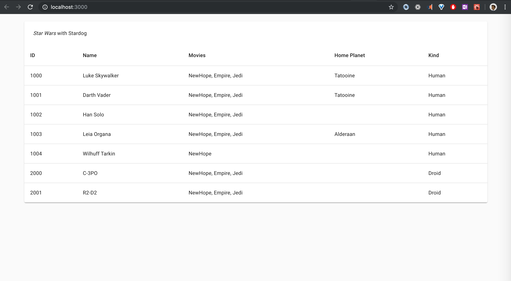

# F1 Knowledge Graph Front End 

## Current Look 


## Download and Run StarDog 
Get Started: [https://www.stardog.com/get-started/](https://www.stardog.com/get-started/)
Docs for settings path and all: [https://www.stardog.com/docs/](https://www.stardog.com/docs/) 

## Load Data to STARDOG
In the project directory, you can run:
```
node src/data/load-data.js
```
This loads the data.ttl file (F1 rdf data in turtle form ) to local Stardog server `localhost:5820`

## Run React App 
In project Directory `yarn start`

Runs the app in the development mode.<br />
Open [http://localhost:3000](http://localhost:3000) to view it in the browser.

The page will reload if you make edits.<br />
You will also see any lint errors in the console.

## Queries
Following is a sample query being used for the current Star Wars dataset, once our F1 ttl data is created on stardog 
we can explore more queries in the StarDog IDE.

### Query 
```
SELECT ?id ?name ?homePlanet ?kind ?movie {
  ?subject a ?kind ;
    :id ?id ;
    :name ?name ;
    :appearsIn ?movie .
  ?kind rdfs:subClassOf :Character .
  OPTIONAL { ?subject :homePlanet ?homePlanet }
}
``` 

### Response
```
{"head":{"vars":["id","name","homePlanet","kind","movie"]},"results":{"bindings":[{"movie":{"type":"uri","value":"http://api.stardog.com/NewHope"},"kind":{"type":"uri","value":"http://api.stardog.com/Human"},"name":{"type":"literal","value":"Luke Skywalker"},"id":{"datatype":"http://www.w3.org/2001/XMLSchema#integer","type":"literal","value":"1000"},"homePlanet":{"type":"uri","value":"http://api.stardog.com/Tatooine"}},{"movie":{"type":"uri","value":"http://api.stardog.com/Empire"},"kind":{"type":"uri","value":"http://api.stardog.com/Human"},"name":{"type":"literal","value":"Luke Skywalker"},"id":{"datatype":"http://www.w3.org/2001/XMLSchema#integer","type":"literal","value":"1000"},"homePlanet":{"type":"uri","value":"http://api.stardog.com/Tatooine"}},{"movie":{"type":"uri","value":"http://api.stardog.com/Jedi"},"kind":{"type":"uri","value":"http://api.stardog.com/Human"},"name":{"type":"literal","value":"Luke Skywalker"},"id":{"datatype":"http://www.w3.org/2001/XMLSchema#integer","type":"literal","value":"1000"},"homePlanet":{"type":"uri","value":"http://api.stardog.com/Tatooine"}},{"movie":{"type":"uri","value":"http://api.stardog.com/NewHope"},"kind":{"type":"uri","value":"http://api.stardog.com/Human"},"name":{"type":"literal","value":"Han Solo"},"id":{"datatype":"http://www.w3.org/2001/XMLSchema#integer","type":"literal","value":"1002"}},{"movie":{"type":"uri","value":"http://api.stardog.com/Empire"},"kind":{"type":"uri","value":"http://api.stardog.com/Human"},"name":{"type":"literal","value":"Han Solo"},"id":{"datatype":"http://www.w3.org/2001/XMLSchema#integer","type":"literal","value":"1002"}},{"movie":{"type":"uri","value":"http://api.stardog.com/Jedi"},"kind":{"type":"uri","value":"http://api.stardog.com/Human"},"name":{"type":"literal","value":"Han Solo"},"id":{"datatype":"http://www.w3.org/2001/XMLSchema#integer","type":"literal","value":"1002"}},{"movie":{"type":"uri","value":"http://api.stardog.com/NewHope"},"kind":{"type":"uri","value":"http://api.stardog.com/Human"},"name":{"type":"literal","value":"Leia Organa"},"id":{"datatype":"http://www.w3.org/2001/XMLSchema#integer","type":"literal","value":"1003"},"homePlanet":{"type":"uri","value":"http://api.stardog.com/Alderaan"}},{"movie":{"type":"uri","value":"http://api.stardog.com/Empire"},"kind":{"type":"uri","value":"http://api.stardog.com/Human"},"name":{"type":"literal","value":"Leia Organa"},"id":{"datatype":"http://www.w3.org/2001/XMLSchema#integer","type":"literal","value":"1003"},"homePlanet":{"type":"uri","value":"http://api.stardog.com/Alderaan"}},{"movie":{"type":"uri","value":"http://api.stardog.com/Jedi"},"kind":{"type":"uri","value":"http://api.stardog.com/Human"},"name":{"type":"literal","value":"Leia Organa"},"id":{"datatype":"http://www.w3.org/2001/XMLSchema#integer","type":"literal","value":"1003"},"homePlanet":{"type":"uri","value":"http://api.stardog.com/Alderaan"}},{"movie":{"type":"uri","value":"http://api.stardog.com/NewHope"},"kind":{"type":"uri","value":"http://api.stardog.com/Droid"},"name":{"type":"literal","value":"C-3PO"},"id":{"datatype":"http://www.w3.org/2001/XMLSchema#integer","type":"literal","value":"2000"}},{"movie":{"type":"uri","value":"http://api.stardog.com/Empire"},"kind":{"type":"uri","value":"http://api.stardog.com/Droid"},"name":{"type":"literal","value":"C-3PO"},"id":{"datatype":"http://www.w3.org/2001/XMLSchema#integer","type":"literal","value":"2000"}},{"movie":{"type":"uri","value":"http://api.stardog.com/Jedi"},"kind":{"type":"uri","value":"http://api.stardog.com/Droid"},"name":{"type":"literal","value":"C-3PO"},"id":{"datatype":"http://www.w3.org/2001/XMLSchema#integer","type":"literal","value":"2000"}},{"movie":{"type":"uri","value":"http://api.stardog.com/NewHope"},"kind":{"type":"uri","value":"http://api.stardog.com/Droid"},"name":{"type":"literal","value":"R2-D2"},"id":{"datatype":"http://www.w3.org/2001/XMLSchema#integer","type":"literal","value":"2001"}},{"movie":{"type":"uri","value":"http://api.stardog.com/Empire"},"kind":{"type":"uri","value":"http://api.stardog.com/Droid"},"name":{"type":"literal","value":"R2-D2"},"id":{"datatype":"http://www.w3.org/2001/XMLSchema#integer","type":"literal","value":"2001"}},{"movie":{"type":"uri","value":"http://api.stardog.com/Jedi"},"kind":{"type":"uri","value":"http://api.stardog.com/Droid"},"name":{"type":"literal","value":"R2-D2"},"id":{"datatype":"http://www.w3.org/2001/XMLSchema#integer","type":"literal","value":"2001"}},{"movie":{"type":"uri","value":"http://api.stardog.com/NewHope"},"kind":{"type":"uri","value":"http://api.stardog.com/Human"},"name":{"type":"literal","value":"Darth Vader"},"id":{"datatype":"http://www.w3.org/2001/XMLSchema#integer","type":"literal","value":"1001"},"homePlanet":{"type":"uri","value":"http://api.stardog.com/Tatooine"}},{"movie":{"type":"uri","value":"http://api.stardog.com/Empire"},"kind":{"type":"uri","value":"http://api.stardog.com/Human"},"name":{"type":"literal","value":"Darth Vader"},"id":{"datatype":"http://www.w3.org/2001/XMLSchema#integer","type":"literal","value":"1001"},"homePlanet":{"type":"uri","value":"http://api.stardog.com/Tatooine"}},{"movie":{"type":"uri","value":"http://api.stardog.com/Jedi"},"kind":{"type":"uri","value":"http://api.stardog.com/Human"},"name":{"type":"literal","value":"Darth Vader"},"id":{"datatype":"http://www.w3.org/2001/XMLSchema#integer","type":"literal","value":"1001"},"homePlanet":{"type":"uri","value":"http://api.stardog.com/Tatooine"}},{"movie":{"type":"uri","value":"http://api.stardog.com/NewHope"},"kind":{"type":"uri","value":"http://api.stardog.com/Human"},"name":{"type":"literal","value":"Wilhuff Tarkin"},"id":{"datatype":"http://www.w3.org/2001/XMLSchema#integer","type":"literal","value":"1004"}}]}}
```

